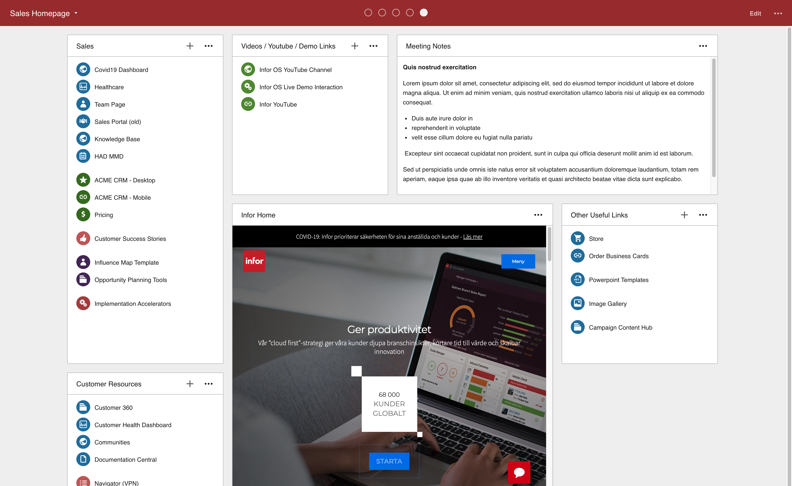
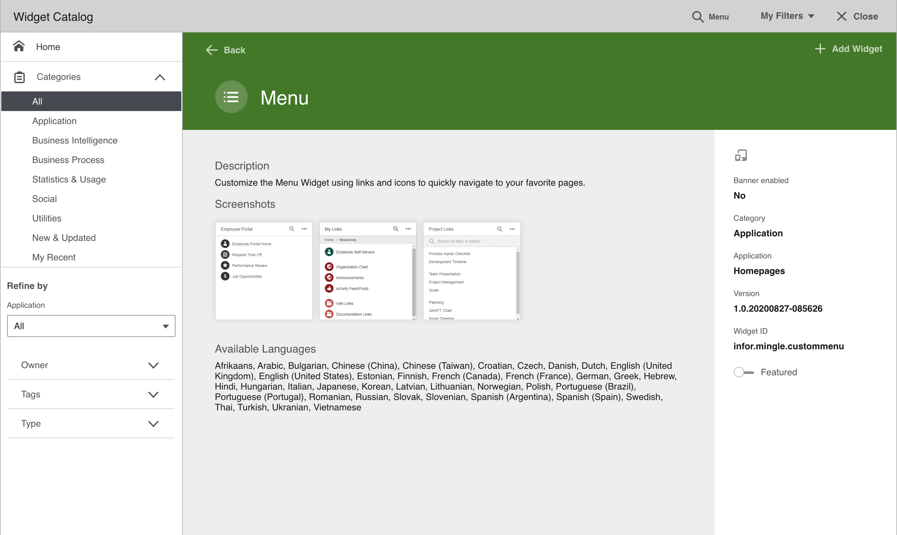
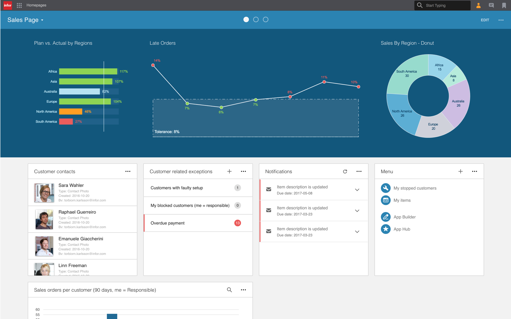

# Best Practices
{: .no_toc }

Here are some best practices to consider when building your widgets. For further reading, please refer to the [Developer's Guide](https://github.com/infor-cloud/homepages-widget-sdk/blob/master/DevelopersGuide.pdf).

## Table of contents
{: .no_toc .text-delta }

1. TOC
{:toc}

## Use ION APIs to communicate with the backend
Lorem ipsum

## Use IDS Enterprise component library
Lorem ipsum

## Theme Support
Lorem ipsum

## Translate your widget
Tailor your widget for end user all around the world by adding translations. We recommend you add language support to match all languages supported by Infor OS. For supported languages, see [Developer's Guide](https://github.com/infor-cloud/homepages-widget-sdk/blob/master/DevelopersGuide.pdf).

### Example
{: .no_toc }
```
"localization": { 
    "en-US": { 
        "widgetTitle": "Hello World", 
        "widgetDescription": "Hello World Sample Widget." 
    } 
}
```
### Further reading
{: .no_toc }
[Developer's Guide](https://github.com/infor-cloud/homepages-widget-sdk/blob/master/DevelopersGuide.pdf)
Chapter 3: Widgets > Widget manifest > Optional manifest properties > **Localization**
Chapter 7: Localization

## Design for all widget sizes 
A widget can be used on a page in 8 different sizes (1x1, 1x2, 1x3, 1x4, 2x1, 2x2, 2x3 and 2x4). Your widget should be runnable in all of these, meaning that all components should be visible and usable. 



Consider optimizing your widget for all widget sizes, by for example showing additional content when the widget is larger than 1x1, or decreasing margins, paddings and/or graphic elements when the widget is smaller to make your widget more efficient.

## Add widget screenshots
You can add up to three PNG image files that will be shown when viewing the widget in the Widget Catalog. The screenshots helps communicate the widget's features and visual experience for your end users. 



Configure your screenshots by adding up to three PNG image files in the widget ZIP. 

The screenshots must be named `screenshot1.png` `screenshot2.png` etc. The image will be displayed in a 200x200px container, and if the image is clicked the image is shown in its original size.

Reference the images using the `screenshots` property in the widget manifest. The value should reflect the number of screenshots. 

### Example
{: .no_toc }
```
"screenshots": "2" 
```

### Further reading
{: .no_toc }
[Developer's Guide](https://github.com/infor-cloud/homepages-widget-sdk/blob/master/DevelopersGuide.pdf)
Chapter 3: Widgets > Widget manifest > Optional manifest properties > **Screenshots for the widget catalog**

## Add Infor Go support
Allow your users to access your widget from the Infor Go mobile application for [Android](https://play.google.com/store/apps/details?id=com.infor.go&hl=en) and [IOS](https://apps.apple.com/bs/app/infor-go/id1446388736). When running on a mobile device the widget can access native device features like GPS information and camera.


Enable your widget for Infor Go by setting the `target` property in the widget manifest to `mobile`.

### Example
{: .no_toc }
```
"target": "mobile"
```

### Further reading
{: .no_toc }
[Developer's Guide](https://github.com/infor-cloud/homepages-widget-sdk/blob/master/DevelopersGuide.pdf)
Chapter 3: Widgets > **Mobile Widget**  

## Build your widgets for the banner area
A Banner widget is a widget that can be added to the banner container. The banner container is located at the top of the page directly below the page header, and always spans the entire first row. It holds between one and four banner widgets and has a background color based on the color of the page.



Enable your widget for the banner area by setting the `target` property in the widget manifest to `banner`.

### Example
{: .no_toc }
```
"target": "banner"
```

### Further reading
{: .no_toc }
[Developer's Guide](https://github.com/infor-cloud/homepages-widget-sdk/blob/master/DevelopersGuide.pdf) 
Chapter 3: Widgets > **Banner Widget**

## Configure a Help URL 
Give your users some help along the way by providing a link to documentation for your widget. The link will be displayed for end users in the About dialog. 

Configure the link by adding the `helpUrl` property in the widget manifest. 

### Examples
{: .no_toc }
```
"helpUrl": "http://www.example.com/" 
"helpUrl": "{Scheme}://{Hostname}:{Port}/{TenantId}/MyApp/Help"
```

### Further reading
{: .no_toc }
[Developer's Guide](https://github.com/infor-cloud/homepages-widget-sdk/blob/master/DevelopersGuide.pdf)
Chapter 3: Widgets > Widget manifest > Optional manifest properties > **Help URL**
