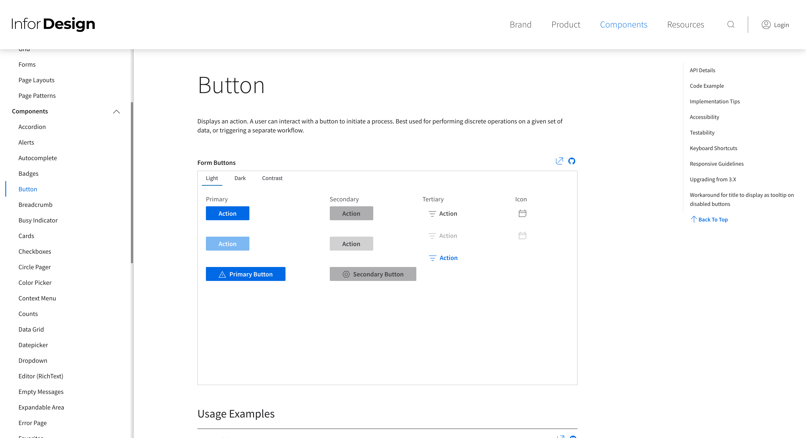
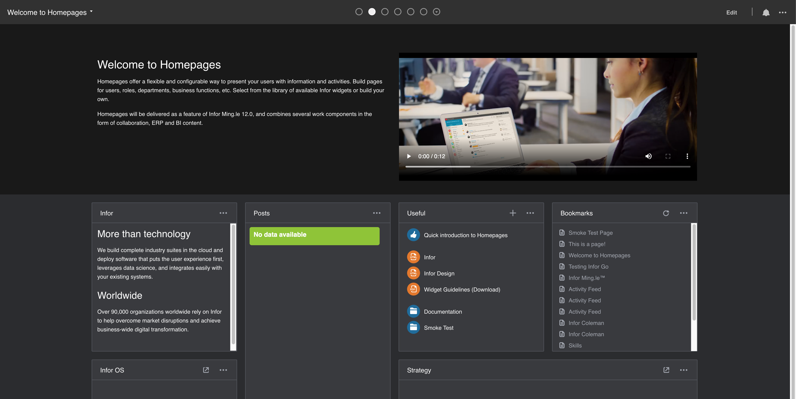
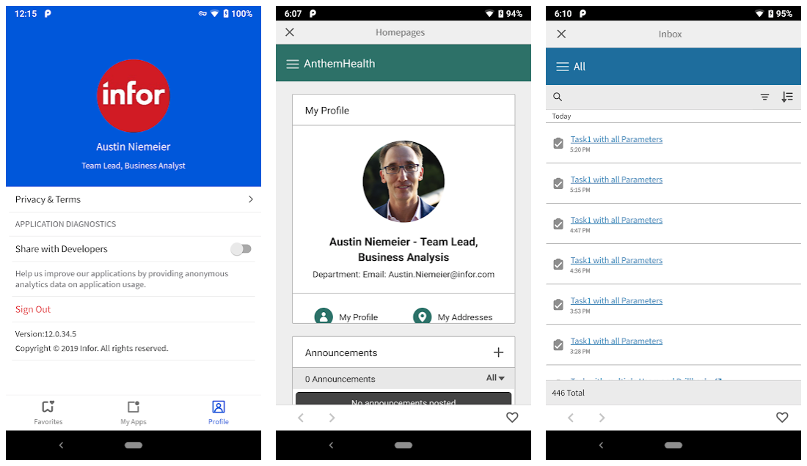

# Best Practices
{: .no_toc }

Here are some best practices to consider when building your widgets. For further reading, please refer to the [Developer's Guide](https://github.com/infor-cloud/homepages-widget-sdk/blob/master/DevelopersGuide.pdf).

## Table of contents
{: .no_toc .text-delta }

1. TOC
{:toc}

## Use ION APIs to communicate with the backend
Widgets should exclusively use ION APIs to communicate with the backend, for example when retrieving data, or creating / updating / deleting data.

*TODO: ADD MORE TEXT/IMAGES/EXAMPLES HERE*

### Further reading
{: .no_toc }
* [Developer's Guide](https://github.com/infor-cloud/homepages-widget-sdk/blob/master/DevelopersGuide.pdf) (Chapter 10: ION API)
* [How to call an ION API](https://www.youtube.com/watch?v=RJCEsnzSdIM)

## Use IDS Enterprise component library
When designing your widget, we strongly recommend using the [IDS Enterprise Components](https://github.com/infor-design/enterprise) for the UI. 



The IDS Enterprise Components is a framework-independent UI component library built in js and css that is pattern-focused, template-driven, touch-enabled, responsive, accessible, and themable.

Complex custom components should always be avoided. If custom styling or components has been used, they must follow the IDS guidelines for look & feel, theming, mobile and accessibility support.

### Further reading
{: .no_toc }
* [Developer's Guide](https://github.com/infor-cloud/homepages-widget-sdk/blob/master/DevelopersGuide.pdf) (Chapter 2: Overview > **Enterprise Components for Infor Design System**)
* [Infor Design System (IDS)](https://design.infor.com/)
* [IDS Enterprise Components](https://github.com/infor-design/enterprise)

## Theme Support
Widgets should support the three theme variants of the IDS Subtle Theme; Light, Dark and High Contrast.  



The IDS Enterprise components automatically supports these theme variants. 

If custom styling or components has been used, those should also align with the IDS look & feel for each theme variant.

### Further reading
{: .no_toc }
* [Developer's Guide](https://github.com/infor-cloud/homepages-widget-sdk/blob/master/DevelopersGuide.pdf) (Chapter 3: Widgets > **Theme Support**)

## Translate your widgets
We recommend that you translate your widgets so that it supports the same languages as supported by Infor OS. For supported the current list of languages, see [Developer's Guide](https://github.com/infor-cloud/homepages-widget-sdk/blob/master/DevelopersGuide.pdf).

Add translations using the `localization` property in the widget manifest.

### Example
{: .no_toc }
```
"localization": { 
    "en-US": { 
        "widgetTitle": "Hello World", 
        "widgetDescription": "Hello World Sample Widget." 
    } 
}
```
### Further reading
{: .no_toc }
* [Developer's Guide](https://github.com/infor-cloud/homepages-widget-sdk/blob/master/DevelopersGuide.pdf) (Chapter 3: Widgets > Widget manifest > Optional manifest properties > **Localization**, Chapter 7: Localization)

## Design for all widget sizes 
A widget can be used on a page in 8 different sizes (1x1, 1x2, 1x3, 1x4, 2x1, 2x2, 2x3 and 2x4). Your widget should be runnable in all of these, meaning that all components should be visible and usable. 


Consider optimizing your widget for all widget sizes, by for example showing additional content when the widget is larger than 1x1, or adjusting margins, paddings and/or graphic elements when the widget is smaller to make your widget more efficient.

## Add widget screenshots
You can add up to three PNG image files that will be shown when viewing the widget in the Widget Catalog. The screenshots helps communicate the widget's features and visual experience for your end users. 


Configure your screenshots by adding up to three PNG image files in the widget ZIP. 

The screenshots must be named `screenshot1.png` `screenshot2.png` etc. The image will be displayed in a 200x200px container, and if the image is clicked the image is shown in its original size.

Reference the images using the `screenshots` property in the widget manifest. The value should reflect the number of screenshots. 

### Example
{: .no_toc }
```
"screenshots": "2" 
```

### Further reading
{: .no_toc }
* [Developer's Guide](https://github.com/infor-cloud/homepages-widget-sdk/blob/master/DevelopersGuide.pdf) (Chapter 3: Widgets > Widget manifest > Optional manifest properties > **Screenshots for the widget catalog**)

## Enable your widgets for Infor Go 
Allow your users to access your widget from the Infor Go mobile application for [Android](https://play.google.com/store/apps/details?id=com.infor.go&hl=en) and [IOS](https://apps.apple.com/bs/app/infor-go/id1446388736). When running on a mobile device the widget can access native device features like GPS information and camera.



Enable your widget for Infor Go by setting the `target` property in the widget manifest to `mobile`.

### Example
{: .no_toc }
```
"target": "mobile"
```

### Further reading
{: .no_toc }
* [Developer's Guide](https://github.com/infor-cloud/homepages-widget-sdk/blob/master/DevelopersGuide.pdf) (Chapter 3: Widgets > **Mobile Widget**)  

## Build your widgets for the banner area
A Banner widget is a widget that can be added to the banner container. The banner container is located at the top of the page directly below the page header, and always spans the entire first row. It holds between one and four banner widgets and has a background color based on the color of the page.


Enable your widget for the banner area by setting the `target` property in the widget manifest to `banner`.

### Example
{: .no_toc }
```
"target": "banner"
```

### Further reading
{: .no_toc }
* [Developer's Guide](https://github.com/infor-cloud/homepages-widget-sdk/blob/master/DevelopersGuide.pdf) (Chapter 3: Widgets > **Banner Widget**)

## Configure a Help URL 
Give your users some help along the way by providing a link to documentation for your widget. The link will be displayed for end users in the About dialog. 

Configure the link by adding the `helpUrl` property in the widget manifest. 

### Examples
{: .no_toc }
```
"helpUrl": "http://www.example.com/" 
"helpUrl": "{Scheme}://{Hostname}:{Port}/{TenantId}/MyApp/Help"
```

### Further reading
{: .no_toc }
* [Developer's Guide](https://github.com/infor-cloud/homepages-widget-sdk/blob/master/DevelopersGuide.pdf) (Chapter 3: Widgets > Widget manifest > Optional manifest properties > **Help URL**)
